# Continuum.ai Architecture Diagrams

This document contains Mermaid diagrams documenting the system architecture, process flows, and component interactions.

## 1. System Architecture

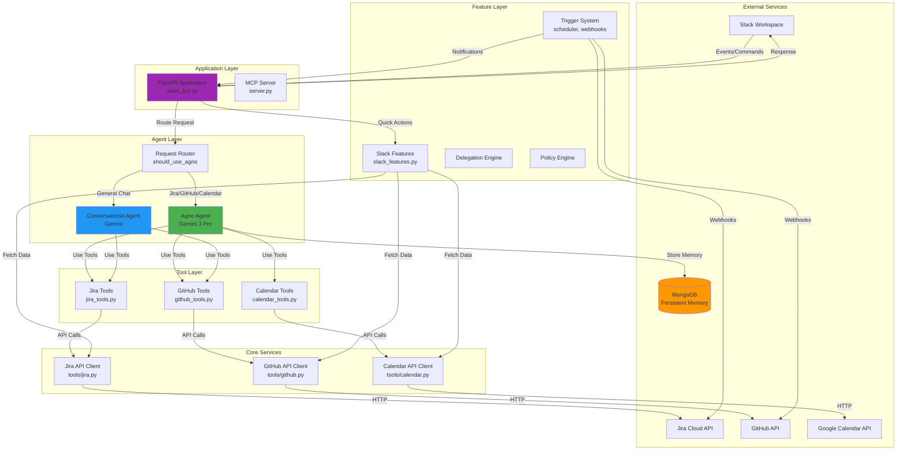

## 2. Request Processing Flow

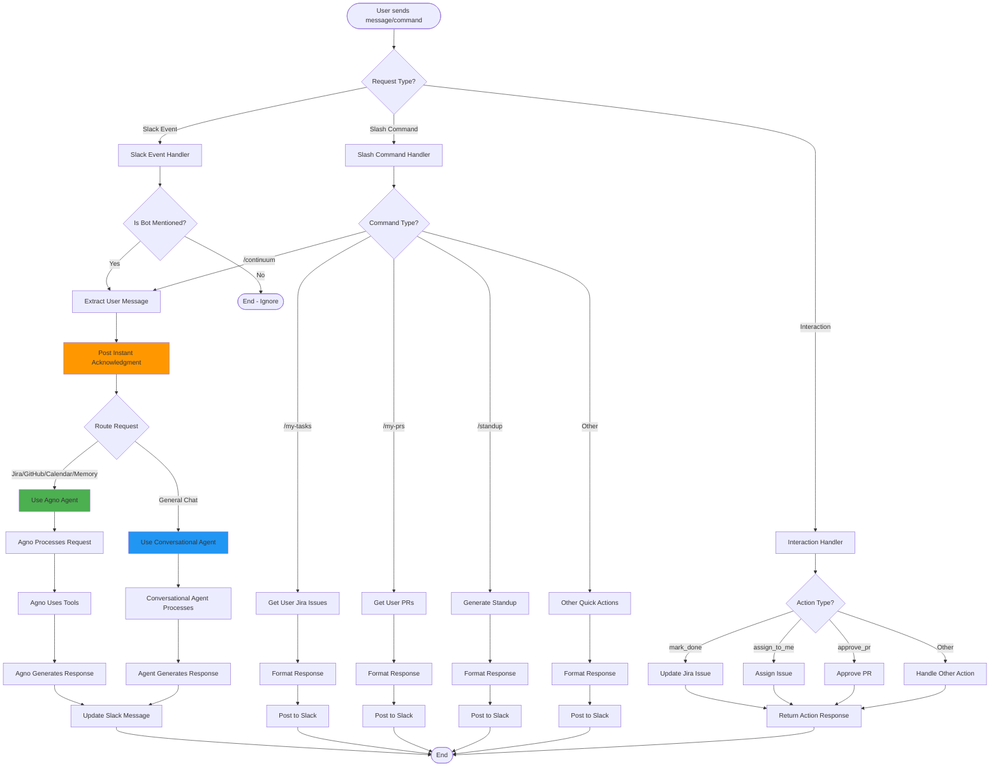

## 3. Agent Routing Logic

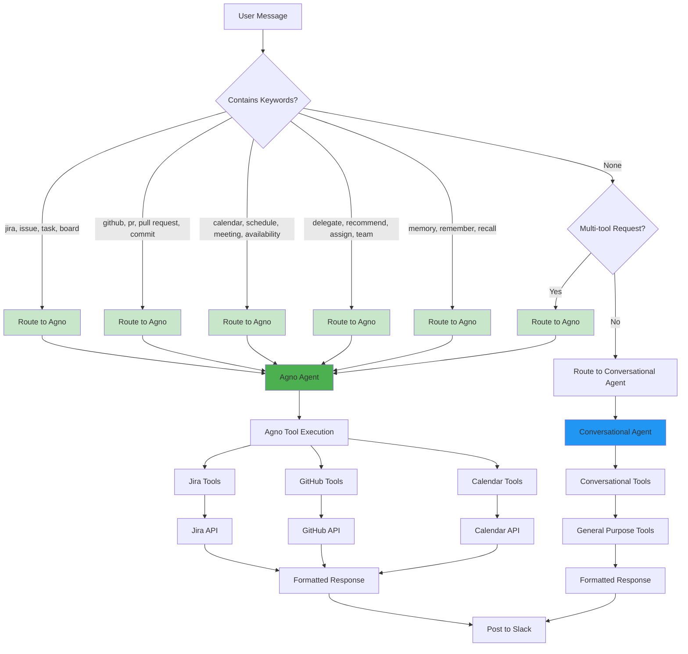

## 4. Agno Agent Tool Execution Flow

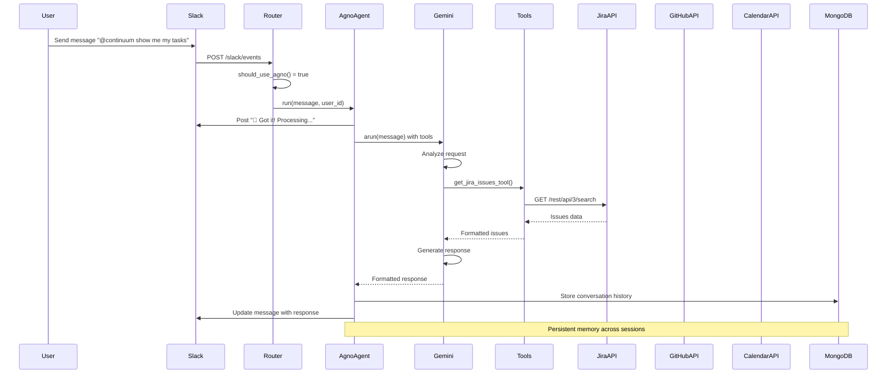

## 5. Multi-Tool Orchestration Flow

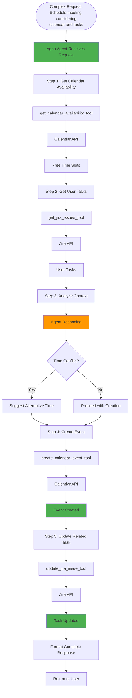

## 6. Data Flow Architecture

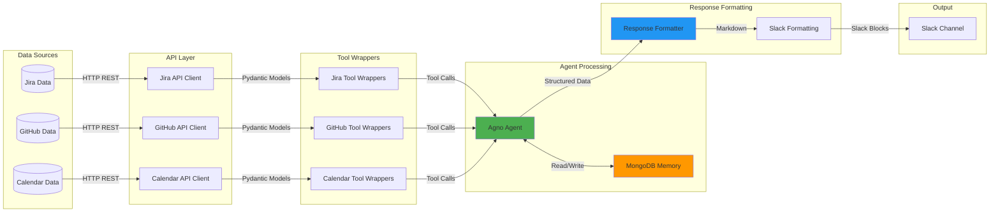

## 7. Trigger System Flow

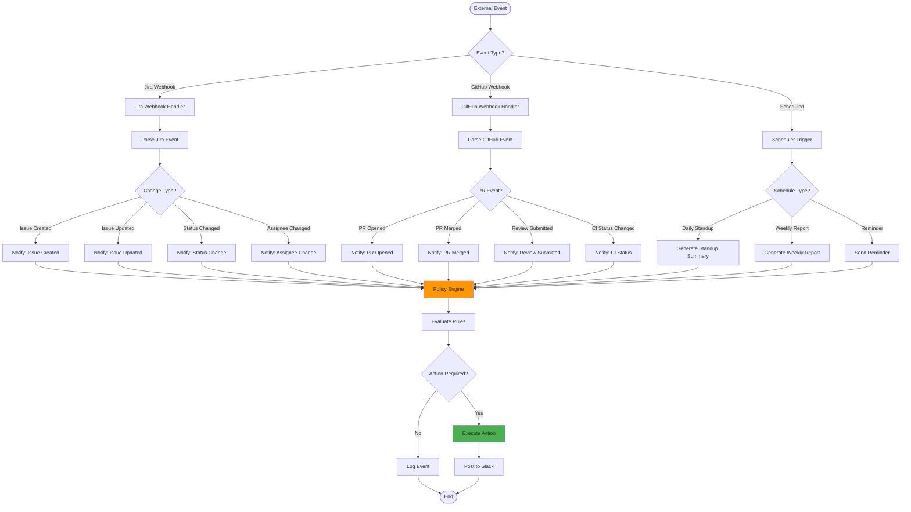

## 8. Memory & Context Persistence

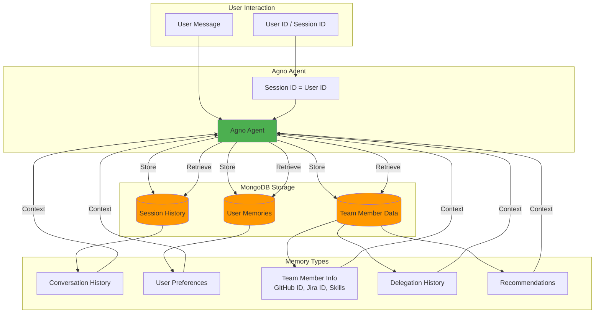

## 9. Slack Features Architecture

```mermaid
graph TB
    subgraph "Slack Commands"
        MyTasks[/my-tasks]
        MyPRs[/my-prs]
        Standup[/standup]
        Blockers[/blockers]
        TeamStatus[/team-status]
        Suggestions[/suggestions]
        MyWeek[/my-week]
    end

    subgraph "Feature Functions"
        GetIssues[get_user_jira_issues]
        GetPRs[get_user_prs]
        GenerateStandup[generate_standup_summary]
        GetBlockers[get_blockers]
        GetWorkload[get_team_workload]
        GetSuggestions[get_context_suggestions]
        GetWeek[get_user_calendar_events_and_tasks]
    end

    subgraph "Data Sources"
        JiraAPI[Jira API]
        GitHubAPI[GitHub API]
        CalendarAPI[Calendar API]
    end

    subgraph "Response Formatting"
        FormatText[Format Text Response]
        FormatBlocks[Format Block Kit]
        ActionButtons[Create Action Buttons]
    end

    MyTasks --> GetIssues
    MyPRs --> GetPRs
    Standup --> GenerateStandup
    Blockers --> GetBlockers
    TeamStatus --> GetWorkload
    Suggestions --> GetSuggestions
    MyWeek --> GetWeek

    GetIssues --> JiraAPI
    GetPRs --> GitHubAPI
    GenerateStandup --> JiraAPI
    GenerateStandup --> GitHubAPI
    GenerateStandup --> CalendarAPI
    GetBlockers --> JiraAPI
    GetWorkload --> JiraAPI
    GetSuggestions --> JiraAPI
    GetSuggestions --> GitHubAPI
    GetWeek --> CalendarAPI
    GetWeek --> JiraAPI

    GetIssues --> FormatText
    GetPRs --> FormatText
    GenerateStandup --> FormatText
    GetBlockers --> FormatText
    GetWorkload --> FormatText
    GetSuggestions --> FormatText
    GetWeek --> FormatText

    FormatText --> ActionButtons
    ActionButtons --> FormatBlocks
    FormatBlocks --> SlackResponse[Slack Response]

    style GetIssues fill:#4CAF50
    style GetPRs fill:#4CAF50
    style GenerateStandup fill:#FF9800
    style FormatBlocks fill:#2196F3
```

## 10. Deployment Architecture

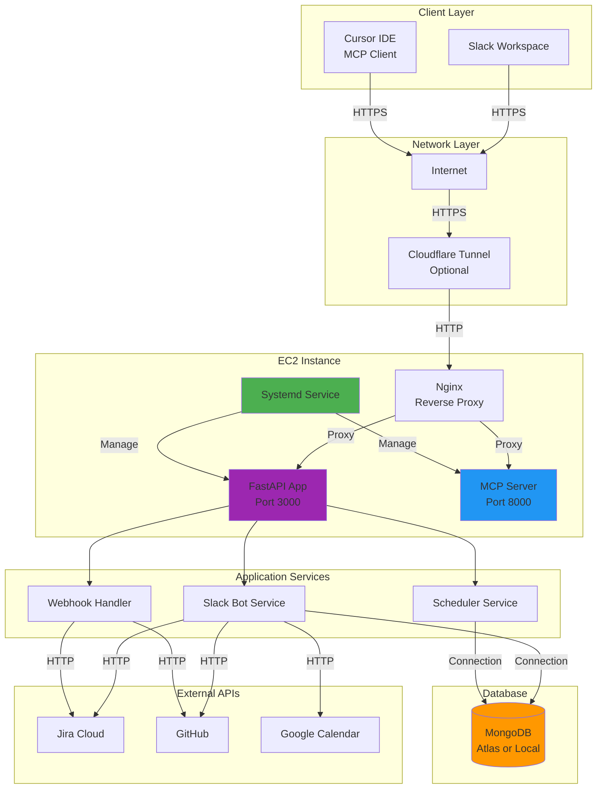

## 11. Error Handling Flow

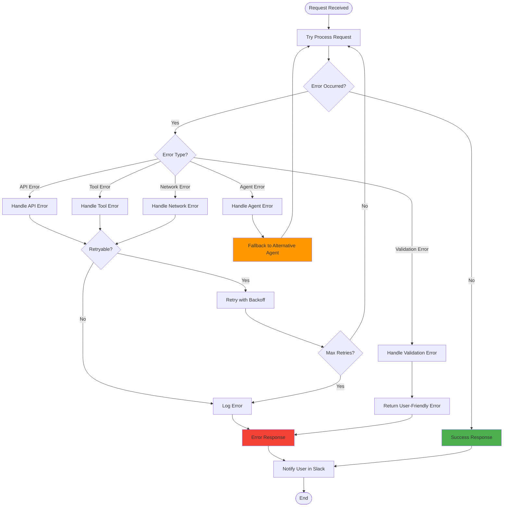

## 12. Tool Integration Pattern

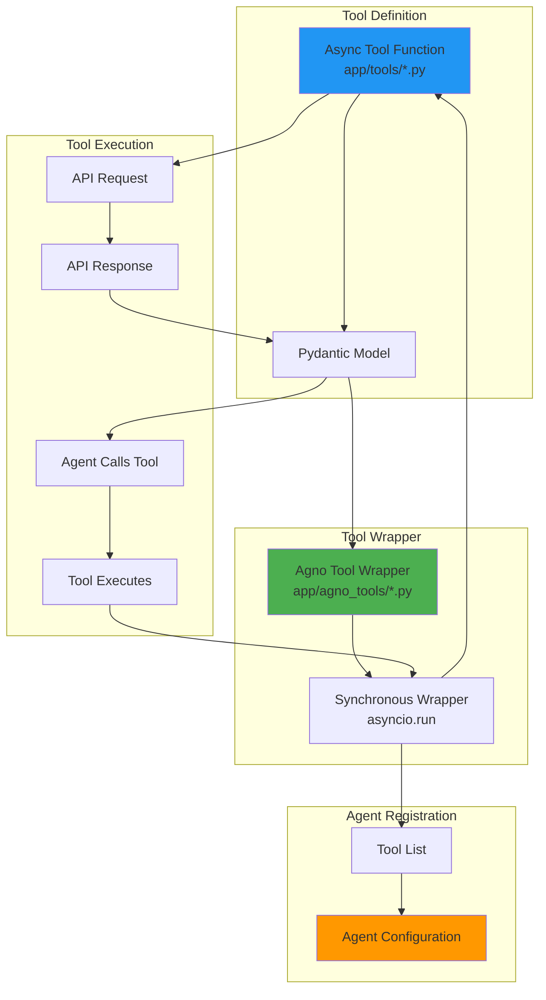

---

## How to Use These Diagrams

1. **View in Markdown**: Most modern Markdown viewers (GitHub, GitLab, VS Code with extensions) will render Mermaid diagrams.

2. **Online Editor**: Use [Mermaid Live Editor](https://mermaid.live) to view and edit these diagrams.

3. **VS Code Extension**: Install the "Markdown Preview Mermaid Support" extension to view diagrams in VS Code.

4. **Documentation**: These diagrams can be embedded in documentation sites that support Mermaid (e.g., MkDocs, Docusaurus).

5. **Export**: Use Mermaid CLI or online tools to export as PNG/SVG for presentations.

---

## Diagram Updates

When updating the system architecture, remember to update the relevant diagrams:

- **System Architecture**: When adding new components or services
- **Request Processing Flow**: When changing request handling logic
- **Agent Routing Logic**: When modifying routing rules
- **Tool Integration Pattern**: When adding new tools or changing tool structure
